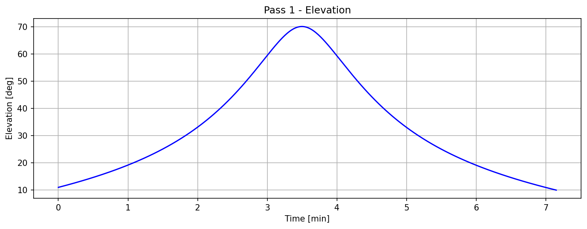
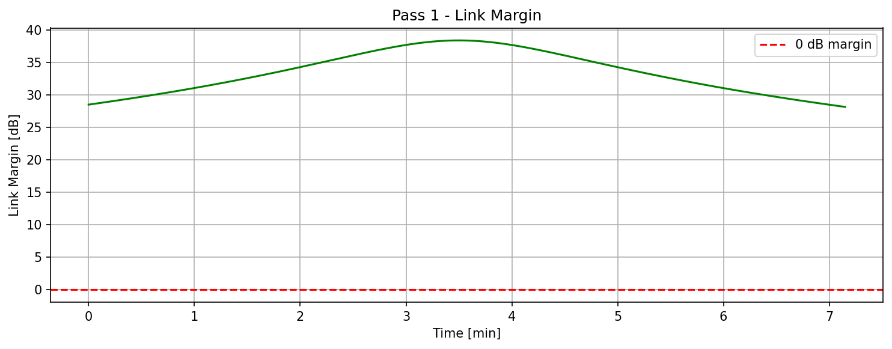
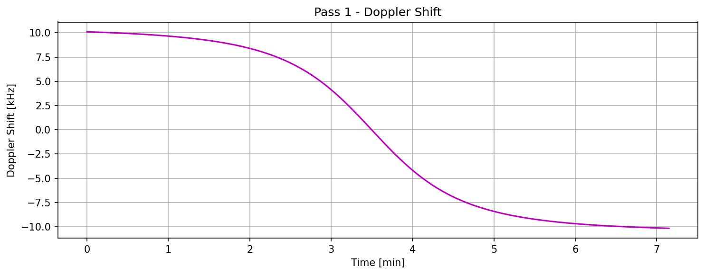
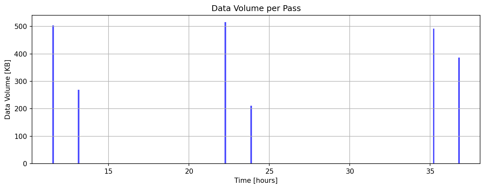
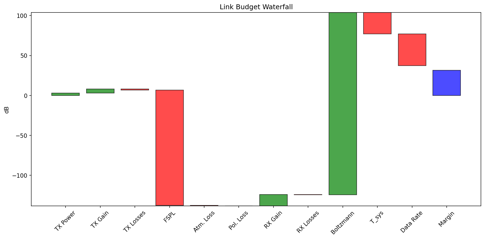
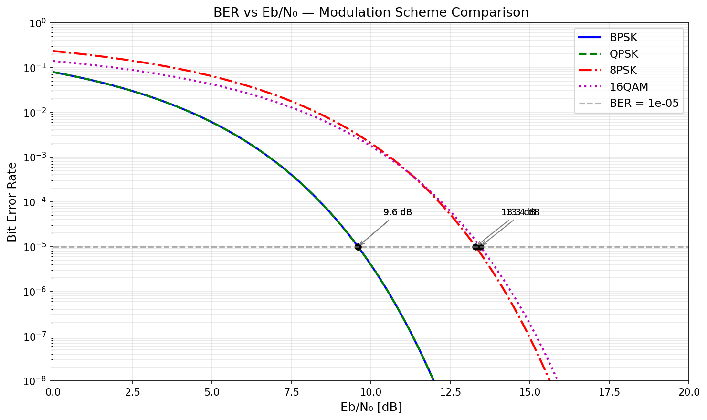
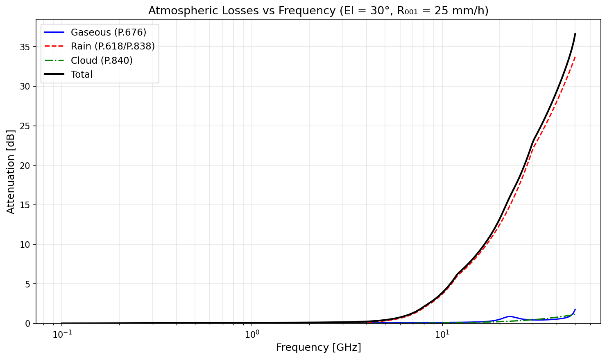
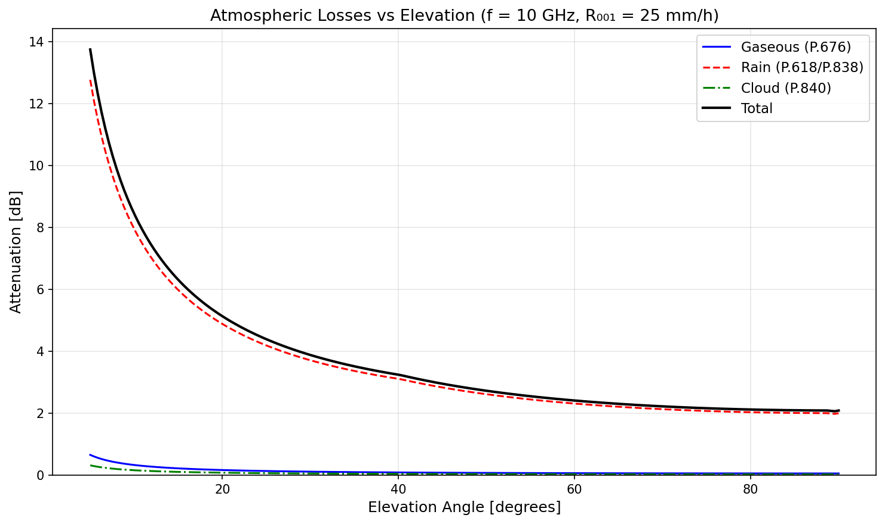
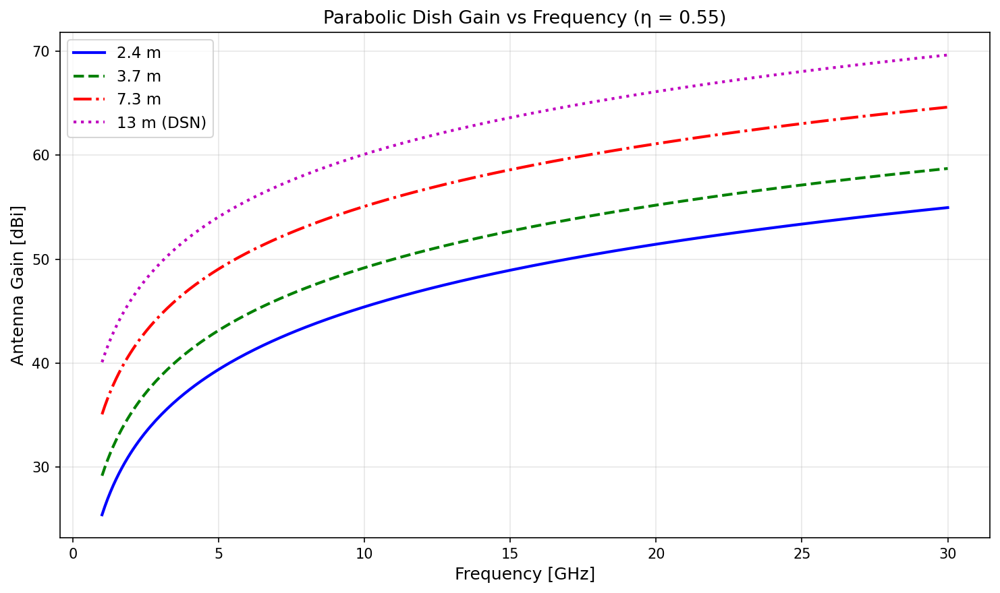

# satlinkbudget

**Aerospace-grade satellite link budget analysis for Python.**


---

## What is satlinkbudget?

satlinkbudget implements the complete RF link budget equation — from transmitter EIRP through free-space path loss and atmospheric propagation to receiver G/T and link margin — coupled with Keplerian orbit propagation for time-varying analysis over satellite passes. It provides the quantitative answer to the fundamental question in spacecraft communications: **does the link close, and by how much margin?**

The library covers the full chain of models needed for satellite link design: ITU-R P-series atmospheric propagation (P.676 gaseous, P.618/P.838 rain, P.840 cloud, P.531 scintillation), six antenna gain models, BPSK/QPSK/8PSK/16QAM modulation with convolutional/turbo/LDPC coding, and a curated database of 31 real-world components from Endurosat, ISIS, Syrlinks, KSAT, NASA DSN, and SatNOGS. Results are produced as detailed line-item reports, waterfall charts, and time-series plots.

---

## Signal Flow

```
TX Power ──→ TX Antenna ──→ Free-Space Channel ──→ RX Antenna ──→ Receiver ──→ Margin
 [dBW]        [dBi]         FSPL + L_atm          [dBi]          G/T
                              [dB loss]                          [dB/K]
                                                                    │
                              ┌──────────────────────────────────────┘
                              ▼
                    C/N₀ → Eb/N₀ → Margin
```

## The Link Budget Equation

```
C/N₀ = EIRP + G/T − FSPL − L_atm − L_pol − L_misc − k_B    [dB·Hz]
Eb/N₀ = C/N₀ − 10·log₁₀(R_b)                                [dB]
Margin = Eb/N₀_received − Eb/N₀_required                      [dB]
```

Where EIRP = P_tx + G_tx − L_feed − L_pointing, G/T = G_rx − 10·log₁₀(T_sys), and k_B = −228.6 dBW/K/Hz.

---

## Key Capabilities

- **RF fundamentals** — free-space path loss, slant range, system noise temperature (Friis), G/T figure of merit
- **ITU-R atmospheric models** — P.676-13 gaseous absorption, P.618-14 / P.838-3 rain attenuation, P.840-8 cloud/fog, P.531-14 ionospheric scintillation
- **Antenna models** — parabolic dish, patch array, axial-mode helix (Kraus), dipole/monopole, horn, pointing loss, polarization mismatch
- **Modulation & coding** — BPSK, QPSK, 8PSK, 16QAM BER curves with convolutional (R=1/2 K=7), turbo, and LDPC FEC coding (CCSDS 131.0-B)
- **Link budget engine** — full line-item C/N₀ → Eb/N₀ → margin, max data rate solver, required TX power solver
- **Orbit propagation** — circular Keplerian with J2 secular perturbation (RAAN drift), ground station contacts, Doppler shift
- **Pass simulation** — time-stepping link budget over satellite passes with elevation-dependent range, atmospheric losses, and data volume tracking
- **Component database** — 31 YAML datasheets: 5 transceivers, 10 antennas, 9 ground stations, 7 frequency bands
- **Mission presets** — 5 ready-to-use configurations: CubeSat UHF/S-band downlink, EO X-band, IoT uplink, deep space X-band
- **Integration adapters** — optional sgp4 and Skyfield adapters for high-fidelity orbit propagation
- **CLI and API** — command-line interface for quick analysis, Pydantic-based API for web integration

---

## Installation

```bash
pip install -e .
```

With optional orbit integrations:

```bash
pip install -e ".[sgp4]"       # SGP4 TLE propagation
pip install -e ".[skyfield]"   # Skyfield high-precision ephemerides
pip install -e ".[all]"        # Everything
```

Requires Python 3.11+. Dependencies: NumPy, SciPy, Pydantic, PyYAML, Matplotlib.

---

## Quick Start: Your First Link Budget

```python
from satlinkbudget.budget import TransmitterChain, ReceiverChain, compute_link_budget
from satlinkbudget.modem import BPSK, CONV_R12_K7, ModemConfig
from satlinkbudget.rf import slant_range

# Satellite: Endurosat UHF II (2W) + monopole antenna
tx = TransmitterChain.from_power_dbm(33.0, antenna_gain_dbi=5.15, feed_loss_db=0.5, pointing_loss_db=1.0)

# Ground station: 10-element UHF Yagi
rx = ReceiverChain(antenna_gain_dbi=14.0, system_noise_temp_k=500.0, feed_loss_db=0.3)

# Modem: BPSK + convolutional R=1/2
modem = ModemConfig(modulation=BPSK, coding=CONV_R12_K7)

# Compute at 500 km, 30° elevation, 9600 bps
result = compute_link_budget(
    transmitter=tx, receiver=rx,
    frequency_hz=437e6,
    distance_m=slant_range(500e3, 30.0),
    data_rate_bps=9600,
    required_eb_n0_db=modem.required_eb_n0_db(),
    atmospheric_loss_db=0.5,
)

print(result.to_text())
```

**Output:**

```
============================================================
LINK BUDGET ANALYSIS
============================================================

TRANSMITTER
  TX Power:               +3.00 dBW
  TX Antenna Gain:        +5.15 dBi
  TX Feed Loss:           -0.50 dB
  TX Pointing Loss:       -1.00 dB
  EIRP:                   +6.65 dBW

PATH
  Frequency:              0.437 GHz
  Distance:               909.5 km
  FSPL:                 -144.43 dB
  Atmospheric Loss:       -0.50 dB
  Polarization Loss:      -0.00 dB

RECEIVER
  RX Antenna Gain:       +14.00 dBi
  RX Feed Loss:           -0.30 dB
  RX Pointing Loss:       -0.00 dB
  System Noise Temp:      500.0 K
  G/T:                   -13.29 dB/K

LINK PERFORMANCE
  C/N₀:                  +77.03 dB-Hz
  Data Rate:               9600 bps
  Eb/N₀ (received):      +37.20 dB
  Eb/N₀ (required):       +5.59 dB
  MARGIN:                +31.62 dB
  Link Closes:         YES
============================================================
```

---

## Quick Start: Pass Simulation

```python
from satlinkbudget.mission import load_mission, build_pass_simulation
from satlinkbudget.simulation._report import generate_report

config = load_mission("src/satlinkbudget/data/missions/cubesat_uhf_downlink.yaml")
sim = build_pass_simulation(config)
results = sim.run(duration_orbits=24, dt_s=1.0)
print(generate_report(results))
```

```
======================================================================
SATELLITE LINK BUDGET - PASS SIMULATION REPORT
======================================================================

Frequency:           437.0 MHz
Data Rate:           9600 bps
Simulation Duration: 37.8 hours

CONTACT SUMMARY
----------------------------------------
Total Passes:        6
Passes per Day:      3.8
Total Contact Time:  33.8 min
Avg Pass Duration:   5.6 min

DATA VOLUME
----------------------------------------
Total Data Volume:   2.436 MB
Total Data Volume:   19488000 bits
======================================================================
```

**Pass simulation plots:**

| Elevation Profile | Link Margin | Doppler Shift | Data Volume |
|:-:|:-:|:-:|:-:|
|  |  |  |  |

---

## Example Outputs

### Link Budget Waterfall



### BER vs Eb/N₀ — Modulation Comparison



### Atmospheric Losses

| Loss vs Frequency | Loss vs Elevation |
|:-:|:-:|
|  |  |

### Antenna Gain vs Frequency



---

## Architecture

```
src/satlinkbudget/
├── rf/              Core RF math (FSPL, noise, dB conversions, constants)
├── atmosphere/      ITU-R atmospheric models (P.676, P.618, P.838, P.840, P.531)
├── antenna/         Antenna gain models (parabolic, patch, helix, dipole, horn) + pointing
├── modem/           Modulation schemes (BER curves) + FEC coding (CCSDS gains)
├── budget/          Link budget engine: TX chain → EIRP, RX chain → G/T, margin
├── orbit/           Keplerian + J2 propagation, ground station geometry, contacts, Doppler
├── simulation/      Time-stepping pass simulation engine + results + report
├── mission/         YAML mission configuration + builder pattern
├── data/            Component database: 31 YAML datasheets + registry
├── contrib/         Optional adapters: sgp4, Skyfield
├── api/             Pydantic request/response API layer
└── validation/      Compatibility and sanity checks
```

---

## Standards Compliance

| Standard | Description | Module |
|----------|-------------|--------|
| ITU-R P.676-13 | Gaseous attenuation (O₂, H₂O) | `atmosphere._gaseous` |
| ITU-R P.618-14 | Rain attenuation (Earth-space) | `atmosphere._rain` |
| ITU-R P.838-3 | Specific rain attenuation coefficients | `atmosphere._rain` |
| ITU-R P.839-4 | Rain height model | `atmosphere._rain` |
| ITU-R P.840-8 | Cloud and fog attenuation | `atmosphere._cloud` |
| ITU-R P.531-14 | Ionospheric scintillation | `atmosphere._scintillation` |
| CCSDS 401.0-B | RF and modulation systems | `modem._modulation` |
| CCSDS 131.0-B | Channel coding (turbo, LDPC) | `modem._coding` |

See [Standards References](docs/standards_references.md) for implementation details and simplifications.

---

## Validation

All models are validated against analytical reference values, ITU-R published data, and textbook examples:

- FSPL: 1 km @ 1 GHz = 92.45 dB (exact)
- P.676: 60 GHz O₂ peak ~15 dB/km (within ±1 dB/km)
- P.838: 12 GHz, 50 mm/h → ~5.6 dB/km (within ±0.5 dB/km)
- Antenna: 3.7m dish @ 8.2 GHz, η=0.55 → 45.9 dBi (exact)
- Doppler: 500 km, 437 MHz → ~10 kHz max shift (within ±0.5 kHz)
- Full UHF CubeSat budget vs SMAD Chapter 13: within 0.5 dB

See [Validation](docs/validation.md) for the complete validation matrix.

---

## Ecosystem

satlinkbudget integrates with the Python satellite ecosystem via optional adapters:

| Package | Purpose | Integration |
|---------|---------|-------------|
| [sgp4](https://pypi.org/project/sgp4/) | TLE orbit propagation | `contrib._sgp4.orbit_from_tle()` |
| [Skyfield](https://rhodesmill.org/skyfield/) | High-precision ephemerides | `contrib._skyfield.orbit_from_skyfield()` |
| [itur](https://github.com/iportillo/ITU-Rpy) | Full ITU-R atmospheric models | Drop-in for `atmospheric_loss_db` parameter |
| [GNU Radio](https://www.gnuradio.org/) | SDR signal processing | Use satlinkbudget to design, GNU Radio to implement |
| [pyorbital](https://github.com/pytroll/pyorbital) | TLE downloading | Feed TLEs to sgp4 adapter |

See [Ecosystem Integration](docs/ecosystem.md) for code examples.

---

## Component Database

| Category | Count | Examples |
|----------|-------|---------|
| Transceivers | 5 | Endurosat UHF II, ISIS TXS S-band, Syrlinks EWC27 X-band |
| Antennas | 10 | Parabolic 3.7m, Yagi UHF 10-el, Patch S-band 2×2, Helix UHF |
| Ground Stations | 9 | KSAT Svalbard, NASA DSN Goldstone/Canberra/Madrid, ESA Kiruna |
| Frequency Bands | 7 | VHF, UHF, S, X, Ku, Ka, Optical |
| Mission Presets | 5 | CubeSat UHF/S-band, EO X-band, IoT uplink, Deep space |

See [Component Database](docs/component_database.md) for the full catalog.

---

## Documentation

| Guide | Description |
|-------|-------------|
| [Getting Started](docs/getting_started.md) | Installation, first link budget, first simulation, CLI usage |
| [Link Budget Walkthrough](docs/link_budget_walkthrough.md) | Expert step-by-step worked example with RF theory |
| [Link Budget Theory](docs/link_budget_theory.md) | Formulas for every model with numerical reference values |
| [Standards References](docs/standards_references.md) | ITU-R, CCSDS, ECSS implementation details |
| [Validation](docs/validation.md) | Cross-checks against reference values, test coverage |
| [Ecosystem Integration](docs/ecosystem.md) | sgp4, Skyfield, itur, GNU Radio, pyorbital |
| [Component Database](docs/component_database.md) | Available components with datasheet sources |
| [API Reference](docs/api_reference.md) | Module and function reference |

---

## Testing

```bash
# Full suite (371 tests)
.venv/bin/pytest tests/ -v

# Specific module
.venv/bin/pytest tests/test_budget/ -v
.venv/bin/pytest tests/test_atmosphere/ -v
```

---

## Contributing

Contributions are welcome. Please:

1. Fork the repository
2. Create a feature branch
3. Add tests for new functionality
4. Ensure all 371+ tests pass
5. Submit a pull request

---

## Citation

```bibtex
@software{satlinkbudget,
  title  = {satlinkbudget: Satellite Link Budget Analysis Library},
  author = {satlinkbudget contributors},
  url    = {https://github.com/satlinkbudget/satlinkbudget},
  year   = {2024},
}
```

---

## License

Apache 2.0 — see [LICENSE](LICENSE) for details.
